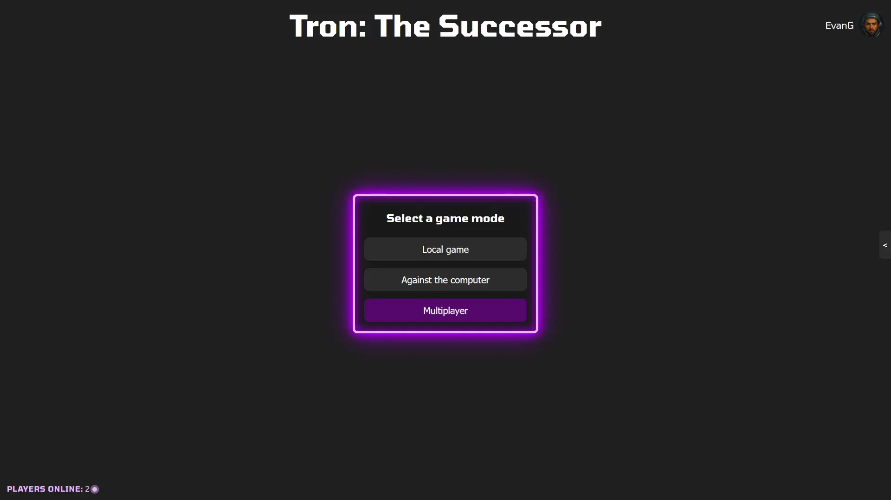
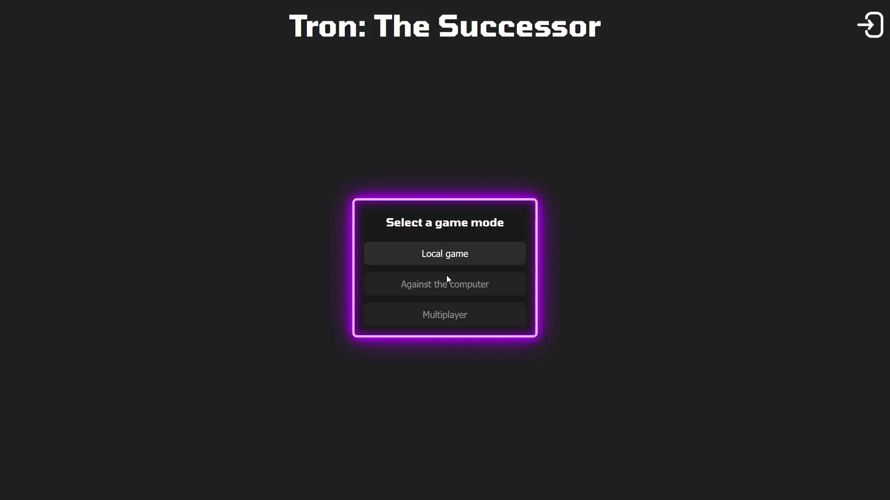
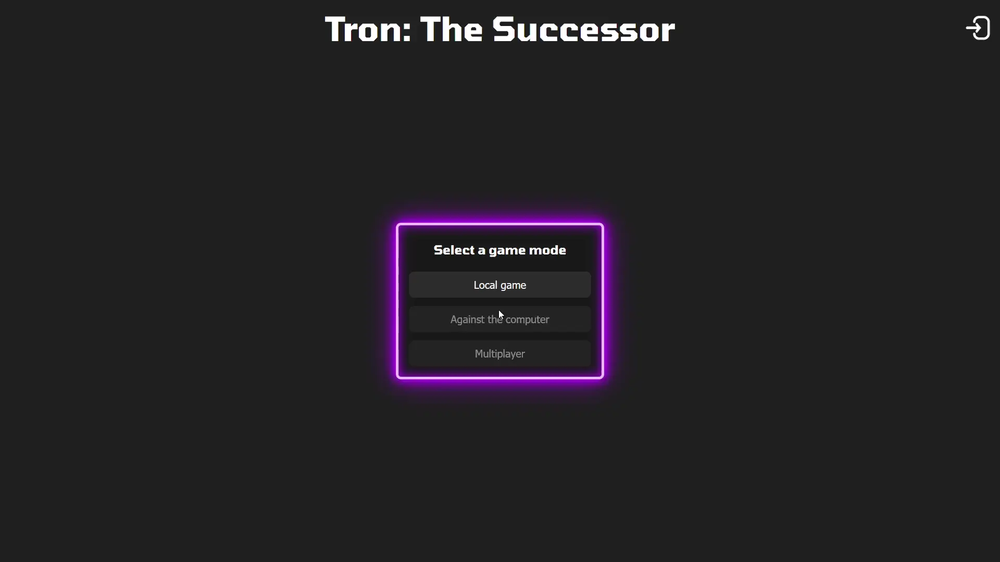
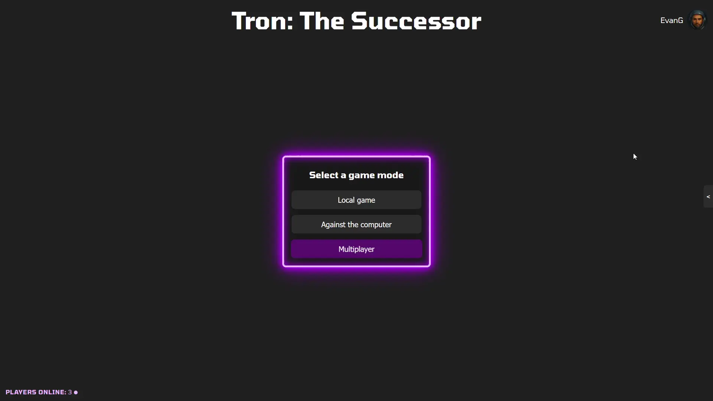

# Front-End

Our front-end is built as a **single-page application (SPA)**.

### Pages

We implemented the following screens:

#### Home

When you visit the site, you are welcomed by the home page, which prominently displays the name of the game.

At the center of the page, you will find buttons for selecting different game modes:

* **Local Game**: Play with someone else on the same computer.
* **Against the Computer**: Challenge our AI.
* **Multiplayer**: Engage in ranked games against other players.

If you are not logged in, you will only be able to play local games. To log in, click the icon in the top right corner of the page.

Once logged in, additional features become available:

* In the bottom left corner, you will see the number of players currently online.
* A small arrow on the right allows you to access various chat rooms.
* Your avatar and username will be displayed. Clicking on them will take you to your settings, profile, or allow you to log out.

#### Login/Logout and Registration (pop-up)

By clicking the login icon in the top-right corner, users access a sign-in pop-up where they can enter their username and password to log in.

For new users, a "Sign up" option initiates a two-step registration form.  
The first step involves:

* choosing a username between 4 and 20 characters,
* entering a password of 7 to 20 characters,
* and confirming the password to ensure accuracy.

An arrow on the right leads to the second step, where users select two security questions and provide answers.  
These questions are used for password recovery if needed.  
Completing these steps and clicking the sign-up button creates the account and automatically logs the user in.  
A "Sign-in" text is also available to return to the login pop-up.

In case of a forgotten password, the "Forgot password" option on the sign-in pop-up prompts users to enter their username to retrieve their security questions.  
Correctly answering these questions allows users to set a new password.

Logged-in users can access their profile and select "Logout", which brings up a pop-up with "Disconnect" and "Cancel" buttons.  
Clicking "Disconnect" logs the user out of the website.

Additionally, clicking outside any pop-up will close it, enhancing user navigation and experience.

#### Game

Before starting a game, a help page is shown that provides essential information such as game rules and controls.  
The player can then press `space` to start the game.

If there is no opponent in the room, a "waiting for opponent" panel is shown.

Once the opponent joins the room, a countdown starts to give the player time to react and it will present the opponent.

The game itself includes:

* A Game Board that shows the current game state, including the players' position and already conquered tiles on the board.

* Game data such as the names of the players and the timer.

* When playing in multiplayer, emotes that players can use to express themselves during the game that are displayed without blocking important information.

In local game, the player can pause the game using `Escape`.

After the game ends, a pop-up appears offering players the option to either queue for another game or return to the home page.

#### Settings

The settings are accessible by clicking on the avatar or username located at the top-right of the screen and then selecting "Settings" in the dropdown.

On the settings page, users have the ability to:

* Personalize their gameplay experience by selecting a unique avatar and spaceship.
* Choose a primary and a secondary color scheme for their tiles and spaceship.  
  The secondary color scheme is used in case of matching primary colors with an opponent.

#### Profile

This page is divided into three distinct tabs:

* Overview: Displays the public profile, showcasing the player avatar along with key stats such as total games played, win rate, current streak, and overall rank.

* History: Allows exploration of the match history in detail. This tab presents a chronological list of past games, offering insights into gameplay patterns, results, and
  performance.
  It provides an easy way to visualize past games, including the opponents faced, match outcomes, and other relevant stats for each match.
  You can only see your own game history.

* Ranking: Showcases the top players worldwide, displaying the global leaderboard.  
  In addition, it features a rank distribution histogram, providing a visual breakdown of how players are distributed across different ranks.  
  This tab offers an overview of the player's position relative to the best players in the world and helps track progress.

#### Chat drawer

Once the drawer is open, it can be closed at any time by clicking anywhere outside of it on the screen.  
By default, the drawer displays a room selection tab, listing ongoing conversations with friends.  
Each friend’s activity status is indicated by a colored circle, providing a quick overview of who is currently online.  
From this tab, it’s possible to open an individual chat conversation or a global chat.
It is possible to open new tabs within the drawer, so that the user can keep multiple conversations opened and easily accessible.

#### Ranking Explanation

The ranking explanation is a pop-up that appears automatically when a game starts.  
It gives players information about how the ranking system works.  
Players can select the "Don't show again" option to stop it from appearing automatically in future games.
However, they can still view it anytime by clicking the (?) icon next to the rank display in the profile page.

### Components

We organized the UI around reusable components to improve maintainability and consistency.  
Every component extends the `HTMLComponent` class which loads and cache the `html` and the `css` required by the component and exposes various events for the component to
listen.  
Here's some of the most notable and most important ones:

* Pages: A component that manages the pages of the website. It reads the URL and shows the corresponding page.
* Loading spinner: A generic spinner that can be used when some content is loading.
* Pop-up : A generic pop-up, centered and in the foreground. Contains a title, a body for the main part and an "action" part, which generally contains buttons. This
  pop-up is notably used for the sign-in, game invitations, pause menu, and end menu.
* Tab navigation: This component handles tab navigation.  
  It supports tab creation and deletion, if the `readonly` attribute is not set.
* Avatar: Displays the player’s avatar and it's reused across multiple UI elements.

---

* Home page: Contains the first page shown upon arriving at the site.
* Game choice: Displays the available game modes. Disables "against the computer" and "multiplayer" options if the user is not logged in.

---

* Chat drawer: Implements the logic and the visual aspect of the drawer, including the handle and the opening animation.
* Chat room: Manages a conversation with a friend or in global chat.  
  It loads the most recent 25 messages (earlier ones are fetched on scroll) and opens a WebSocket so new messages arrive in real time.
* Chat room message: It is used in the chat room selection tab and shows:
  * The room name (global chat or friend’s name).
  * A preview of the last message sent.
  * An icon for the room. For friend chats, it corresponds to the friend’s avatar associated with a status badge.
  * In case of friend chats, a "fight" icon is displayed to send a game invitation.

---

* Help page: Explains how the game works and details the controls for different modes. Also displays the player's chosen colors and spaceship.
* Control: Shows controls for the different players.
* Game board: Renders any given game state. It is used to show the board while playing (local, AI, or online), for replaying past games in history, and for previewing
  controls before a match.
* Game emote: Is used to display the different emotes available and their input associated
* Game emote display: Is created when a player sends or receives an emote. This is the component in charge of displaying it.
* Game master: Manages gameplay, controls the player, visually updates the game's progress using the game board, and, in online games, manages communications with the
  server.

---

* Profile history: Displays a chronological list of games that the player has participated in.  
  By default, it loads the ten most recent games.  
  To view additional games, users can scroll down, prompting the system to load more entries.
* Game result: Represents the outcome of a game in the game history, including win/loss/draw status, opponent name, game duration, and date.
* Replay: Displays a replay of a game using the stored game data from each match.
  This component is found with each game result, allowing players to review how the game was played and could be used to replay the game directly once it's finished.
* Profile rank: Draws the polygon for the rank (Line, Triangle, Square, Pentagon and Hexagon).
* Rank repartition: Shows total player count and calculate the rank distribution, so users can see how many players hold each rank.
* Settings page: Displays the different avatar, spaceships and color the player can choose to personalize it's game experience.

If you want to see all of them, you can find them all in [`services/files/front/components`](front/components)
